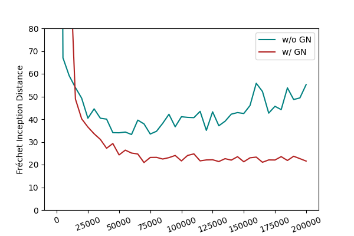

# GNGAN-Tensorflow

A simple re-implementation of the paper "Gradient Normalization for Generative Adversarial Networks" in Tensorflow 2.

Original Paper: [https://arxiv.org/abs/2109.02235](https://arxiv.org/abs/2109.02235)

Official implementation in PyTorch: [https://github.com/basiclab/GNGAN-PyTorch](https://github.com/basiclab/GNGAN-PyTorch)

## Prerequisite
+ Python 3.8.10
```bash
pip install -r requirements.txt
```

## Datasets
+ [CIFAR-10](https://www.cs.toronto.edu/~kriz/cifar.html)

    Keras built-in CIFAR-10 will be downloaded automatically.

+ [DVM-CAR](https://deepvisualmarketing.github.io/)

    Download the dataset from [this link](https://www.dropbox.com/s/xmyz2na20f8lth8/Confirmed_fronts.zip?dl=0) and unzip the ZIP file. This dataset is used for the final project of the course Introduction to Intelligent Computing (NTHU CS460100) where we use GAN to generate cars images. [train_cGAN.py](train_cGAN.py) is used to train a conditional GAN that can generate cars images based on car brands.

## Training
```bash
# train cifar10 with dcgan
python3 train.py --dataset=cifar10 --arch=dcgan.32 --num_images=50000 --logdir=logdir/cifar10_dcgan
# train cifar10 with resnet
python3 train.py --dataset=cifar10 --arch=resnet.32 --num_images=50000 --logdir=logdir/cifar10_resnet --n_dis=5 --lr_D=0.0004
# more information
python3 train.py --help
```

+ Generate images from checkpoints
```bash
# generate cifar10 with dcgan
python3 demo.py --ckpt=logdir/cifar10_dcgan/model/ --arch=dcgan.32 --logdir=output/cifar10_dcgan
# generate cifar10 with resnet
python3 demo.py --ckpt=logdir/cifar10_resnet/model/ --arch=resnet.32 --logdir=output/cifar10_resnet
```

+ Save images sampled in training process as GIF
```bash
# generate gif of cifar10 with dcgan
python3 gif.py --path=logdir/cifar10_dcgan/sample/
# generate gif of cifar10 with resnet
python3 gif.py --path=logdir/cifar10_resnet/sample/
```

## Effectiveness

Training dcgan32 on cifar10, the one with Gradient Normalization shows superior result.



## Citation
This project is largely based on the original implementation [GNGAN-PyTorch](https://github.com/basiclab/GNGAN-PyTorch). Below is the citation of their paper!
```
@InProceedings{GNGAN_2021_ICCV,
    author = {Yi-Lun Wu, Hong-Han Shuai, Zhi Rui Tam, Hong-Yu Chiu},
    title = {Gradient Normalization for Generative Adversarial Networks},
    booktitle = {Proceedings of the IEEE International Conference on Computer Vision (ICCV)},
    month = {Oct},
    year = {2021}
}
```